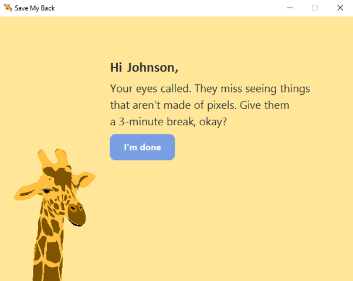

#  Save my back - Walk reminder

**Save my back** is a lightweight desktop application built with **JavaFX** designed to look after your spinal health. The app runs in the background and periodically reminds you to step away from your desk, stretch, and take a short walk.

### Features
* **Notifications:** Displays friendly desktop alerts when it's time for a break.
* **Spine-Focused:** Encourages regular physical movement to prevent stiffness and fatigue.

### Technology
* **Java** – Application logic and structure.
* **JavaFX** – Graphical user interface.
* **JUnit 5** – Unit testing for reliable background tasks.

<table>
  <tr>
    <td></td>
    <td></td>
  </tr>
</table>

### Continuous Integration (CI)

The project uses **Java CI with Maven** powered by GitHub Actions.
Every push to the master branch automatically triggers:
* project compilation,
* execution of all JUnit tests,
* validation of the build process.

This ensures that the application is continuously tested and remains stable as new features and improvements are introduced.