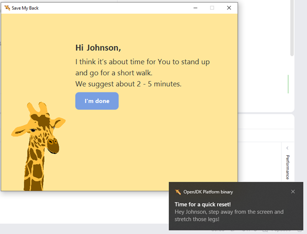
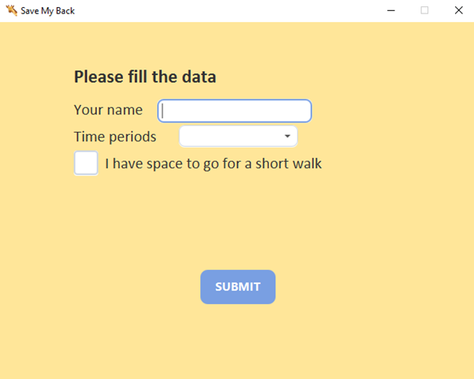
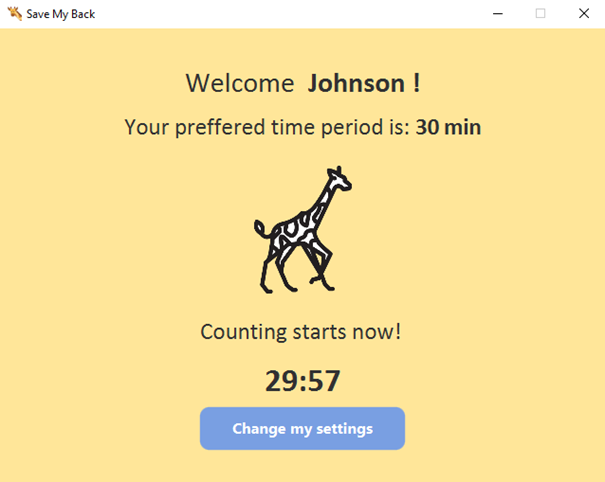

#  Save my back - Walk reminder

**Save my back** is a lightweight desktop application built with **JavaFX** designed to look after your spinal health. The app runs in the background and periodically reminds you to step away from your desk, stretch, and take a short walk.

Technology behind the project: **Java**, **JavaFX**, **JUnit**.

